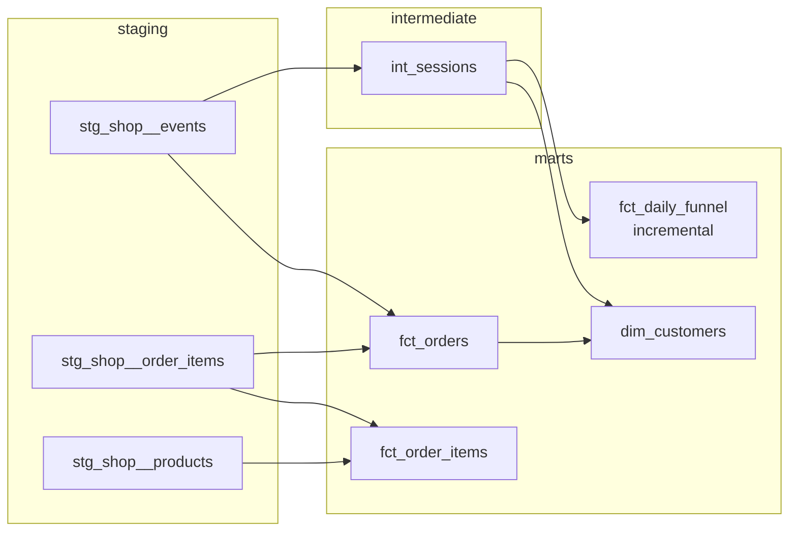

# dbt-ecommerce-warehouse

A dbt project that models a fictional online coffee shop's events into a small warehouse: staging, intermediate and marts, with tests that reconcile every order against its lines and its payment. Runs on DuckDB, so `make build` works on a laptop in under a second.

It is the third piece of a small end-to-end data platform. It reads the clean Parquet written by [pyspark-glue-ingestion](https://github.com/markotalledo/pyspark-glue-ingestion), which reads what [events-pipeline-aws-terraform](https://github.com/markotalledo/events-pipeline-aws-terraform) lands in S3.


Recorded from `scripts/demo.sh`, which runs both builds and trims dbt's log to the lines that matter. Re-record with `vhs docs/demo.tape`.



## Quickstart

```bash
make setup    # uv sync: dbt-core and dbt-duckdb
make build    # 8 models, 1 seed, 26 tests
make bug      # corrupts order lines; the reconciliation test catches it
make serve    # dbt docs with lineage at localhost:8080
```

The input in `fixtures/clean` is real output of the upstream Spark job: 1,103 events from 150 sessions, 38 orders, 88 customers.

## Models

| Layer | Model | Grain | What it adds |
|---|---|---|---|
| Staging | `stg_shop__events` | event | Types and names; no business logic |
| Staging | `stg_shop__order_items` | order line | |
| Staging | `stg_shop__products` | product | Catalog from a seed |
| Intermediate | `int_sessions` | session | Funnel flags, and the customer resolved for sessions that log in at checkout |
| Marts | `fct_orders` | order | Lines and payment joined; `reconciliation_status` |
| Marts | `fct_order_items` | order line | Category and price against list price |
| Marts | `dim_customers` | customer | First touch, sessions, orders, lifetime value |
| Marts | `fct_daily_funnel` | day and client | Sessions per funnel step and conversion rate |

## Tests that check the business, not just the columns

Generic tests cover keys, accepted values and relationships. Three singular tests check what a finance or product team would actually ask:

- **Every order total equals the sum of its lines** (`assert_order_lines_sum_to_total`).
- **Every order has a captured payment for exactly its total** (`assert_payments_reconcile`).
- **The funnel only narrows**: no step has more sessions than the step before it (`assert_funnel_is_monotonic`).

`make bug` turns on a variable that doubles the quantity of every first order line. The column tests still pass, every key is still unique and not null, but the reconciliation test fails on all 38 orders. CI runs this on every push and fails if the bug ever gets through.

## Design decisions

- **Layers have one job each.** Staging only renames and types. Business logic starts in intermediate. Marts never read sources directly.
- **Identity is resolved per session.** An anonymous session that logs in at checkout only has `customer_id` on its last events; `int_sessions` carries it to the whole session, so the funnel and first-touch attribution see one customer, not two.
- **The incremental funnel rebuilds a window.** Late mobile events can complete a session days later. `fct_daily_funnel` uses `delete+insert` on `(session_date, app_source)` and rebuilds the last `funnel_lookback_days` days on every run, instead of only appending today.
- **Sessions are dated by when they start.** A session that crosses midnight is counted once, on its first day.
- **No packages.** The one generic test that is not built in, `unique_combination`, is six lines in `macros/`. Fewer dependencies, faster CI, nothing to break on upgrade.

## Pointing it at real data

The source location lives in one place, `models/staging/_sources.yml`. Change `external_location` to `read_parquet('s3://<clean-bucket>/{name}/*/*.parquet', hive_partitioning = true)` and configure DuckDB's `httpfs` with AWS credentials. The same models run on Redshift, Snowflake or BigQuery with an adapter change and minor SQL dialect edits.

## License

MIT
